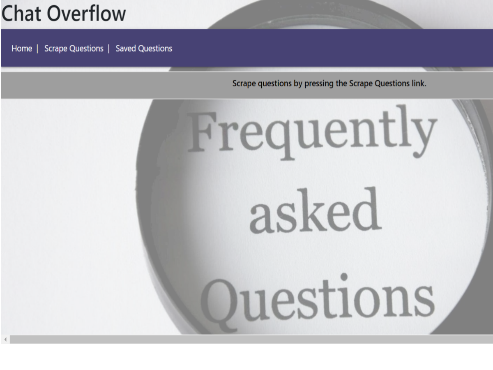

# Chat OverFlow

An app that allows you to view the latest questions on StackOverflow and leave comments on the question.

**How to run this app:** 
This app is deployed through Heroku. You must go to the link listed below to access it. 
1. In order to view the scraped articles, you must click on the tab "Scrape Questions".
2. A list of articles will be displayed in seperate boxes, listed by title. 
3. If you are interested in reading the article, click the blue "link to question" link.
4. Hit the back arrow to get back to the home screen. 
5. If you would like to save the article to view later, click the teal "save question". It will save the question to the database. 
6. If you want to go back to view the save article, click on the "saved questions" tab at the top. A modal will pop up and show you the title and the link to the article. Simply click outside the modal window to go back to the home screen. 

**Link to App:** 
[Chat OverFlow hosted on Heroku](https://chatterbox-looksue.herokuapp.com/)

**Summary:**
This is an ORM app that is supported by Handlebars, Express, Node, Mongoose, Cheerio, and Axios. This app is able to scrape the current questions from the developer-oriented arrgigator site Stack OverFlow.  
    
**Motivation:** To create a full-stack application hosted on Mongoose, get additional experience with handlebars, and use Cheerio.  

**Tech/Framework:** Node, Express, JavaScript, Mongoose, Handlebars, Cheerio, Axios, ORM

**App Styling Image:

**Link to Project:**
[Chat Overflow](https://github.com/looksue/chatterbox)
